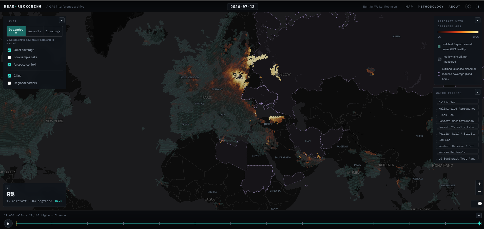
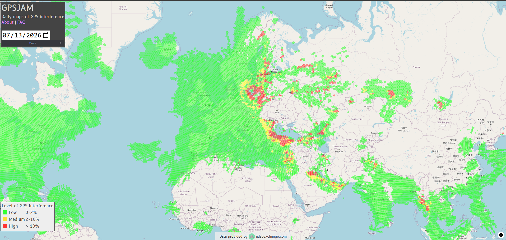

# DeadReckoning × GPSJam — visual cross-check, 2026-07-13

**Date compared:** 2026-07-13 (UTC).
**Sources:** DeadReckoning (this project, built from **adsb.lol** feeds) vs
[gpsjam.org](https://gpsjam.org) (built from **ADS-B Exchange** feeds).
**Method:** side-by-side visual comparison of the same UTC day at continental zoom
over Europe / the Black Sea.

## What agrees
Both maps light up the same major interference zones on this date:

- **Baltic / Kaliningrad complex** — the largest, most saturated zone on both.
- **Black Sea western rim + Istanbul + eastern Turkey** — a connected arc of
  degradation on both.
- **Moscow-area spots** — discrete elevated cells on both.
- **Eastern Mediterranean** — present at the frame edge on both.

Two **independent upstream networks** (ADS-B Exchange vs adsb.lol), processed by
**independent pipelines** with **different thresholds**, agreeing on *where* and
*when* is meaningful external corroboration: it argues the signal is a property of
the airspace on that date, not an artifact of one project's feed or method.

## Expected differences (not disagreements)
- **Coverage footprint differs.** Different feeder networks see different aircraft,
  so the edges of coverage — and sparse-sample regions — will not match cell for
  cell. Absence in one map at the periphery is usually a coverage difference.
- **Thresholds and coloring differ.** GPSJam bins by its own high/low NIC fraction
  and color scale; DeadReckoning uses `nic ≤ 6` per-aircraft majority with an
  aircraft-count floor (see [`../../METHODOLOGY.md`](../../METHODOLOGY.md)). So the
  *intensity* and exact cell boundaries differ even where both agree a zone is hot.
- **Aggregation geometry differs** (their grid vs our H3 res-4 hexes).

## The honest caveat
This is **visual corroboration between two ADS-B-derived estimates, not validation
against ground truth.** Neither project measures the RF environment directly; both
infer interference from reported navigation integrity. Agreement raises confidence
that the inference is capturing something real; it does not confirm cause
(jamming vs spoofing vs other), magnitude, or attribution. It is one dated
cross-check, not a calibration.
